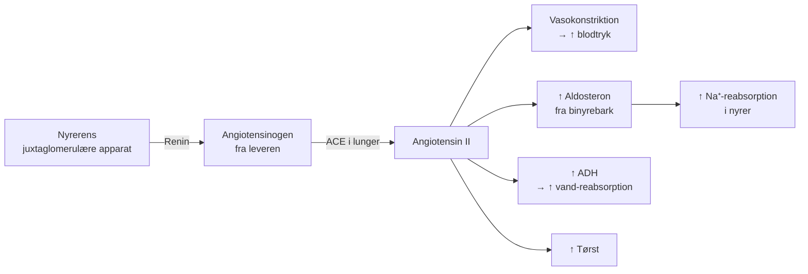

# Renin-Angiotensin-Aldosteron System (RAAS)

> [!tip] **Hovedprincip:** RAAS er et hormonelt feedback-system der regulerer **blodtryk**, **væskebalance** og **natrium-homeostase**. Aktiveres ved lavt blodtryk, lavt Na⁺ eller sympatikus-stimulation.

## Kaskaden

## Trin for trin

| Trin | Enzym/komponent | Hvor | Effekt |
|------|----------------|------|--------|
| **1. Renin** | Renin (protease) | Juxtaglomerulære celler i nyre | Spalter angiotensinogen |
| **2. Angiotensin I** | – | Blodet | Inaktivt decapeptid |
| **3. ACE** (Angiotensin Converting Enzyme) | ACE | Lunger (og endotel) | Omdanner AI → AII |
| **4. Angiotensin II** | – | Blodet | **Hovedeffektoren** (oktapeptid) |

## Effekter af Angiotensin II

| Målorgan | Effekt |
|----------|--------|
| **Blodkar** | Vasokonstriktion → ↑ perifer modstand → ↑ blodtryk |
| **Binyrebark** | Stimulerer aldosteron-syntese |
| **Hypofyse** | Stimulerer ADH (vasopressin)-frigivelse |
| **Hjerne** | Øger tørstfornemmelse |
| **Nyre** | Øger Na⁺-reabsorption (direkte + via aldosteron) |
| **Hjerte** | Positiv inotrop effekt (øger kontraktilitet) |

## Aldosteron

- **Produceres i:** Zona glomerulosa i binyrebarken
- **Virkning:** Øger Na⁺-reabsorption (og dermed vand) i distale tubulus og samlerør
- **Mekanisme:** Gen-regulering → ↑ Na⁺/K⁺-ATPase + ENaC-kanaler
- **Bivirkning:** K⁺-udskillelse (aldosteron → K⁺-tab i urinen)

> [!warning] **Klinisk:**
> - **ACE-hæmmere** (f.eks. ramipril, enalapril): bruges mod hypertension og hjerteinsufficiens – hæmmer RAAS
> - **ARB** (Angiotensin II-receptor-blokkere, f.eks. losartan): blokerer AT₁-receptoren
> - **Hyperaldosteronisme** (Conn's syndrom): ↑ blodtryk, ↓ K⁺ → muskelsvaghed

## Se også
[[ANP]] · [[Glucose-reabsorption]] · [[Kap 48]] · [[Filtrering og reabsorption]]
